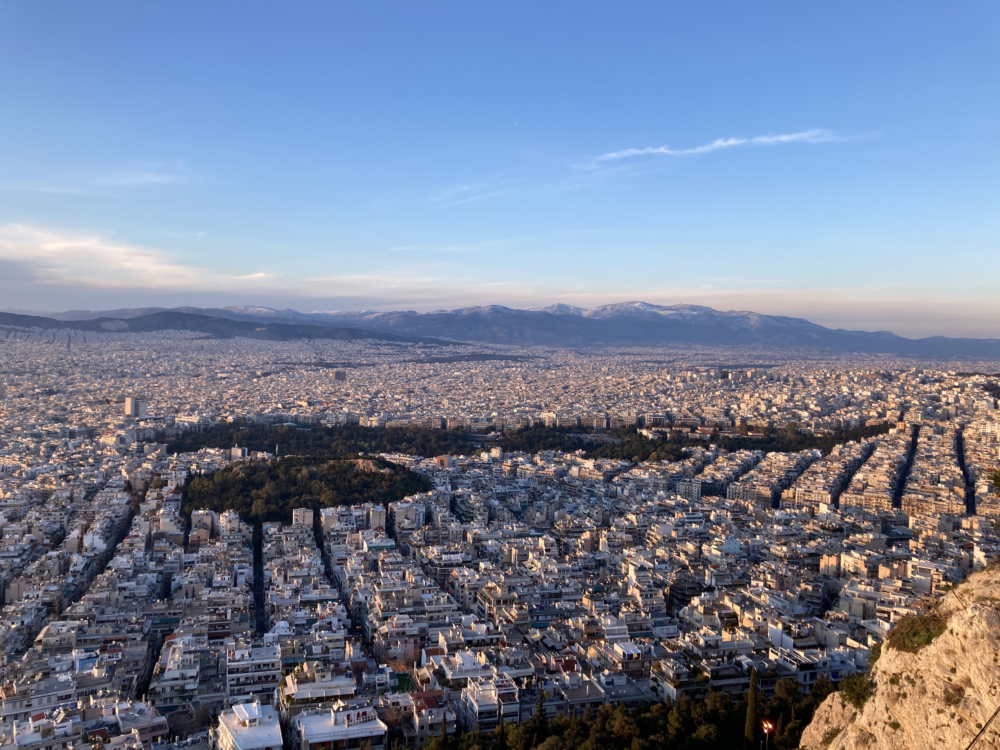

# K-means-art
K-means can be used for image compression or in this case "art"!
The function `image_kmeans_mosaic` takes a jpg image as input and returns a figure with image subplots for varying numbers of K.

**input image:**  
  
**output image:**  
  

Simply increasing clusters by 1 on each iteration is boring. 
`image_kmeans_mosaic` supports arithmetic, geometric and fibonacci progressions.
